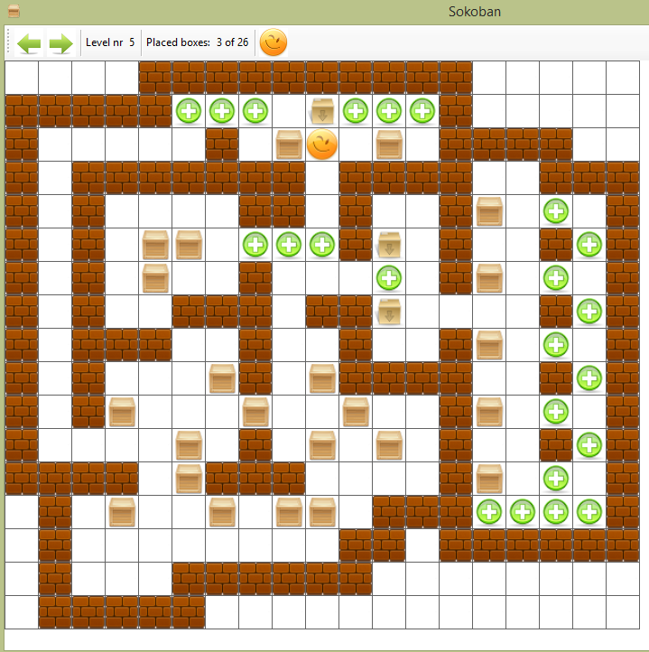

# Sokoban Game
> Desktop game in which the player pushes boxes around in a warehouse, trying to get them to storage locations.

## Table of contents
* [General info](#general-info)
* [Screenshots](#screenshots)
* [Technologies](#technologies)
* [Contact](#contact)

## General info
Application written by me in 2015 as part of the study of the course of data structures.
Custom realization of wide known game. Movement control using keyboard arrows. Creation any levels manually in a .txt file

## Screenshots

## Technologies
* C#
* Windows Forms

## Contact
Created by Anton Kozhanov [deal.for at gmail.com]
